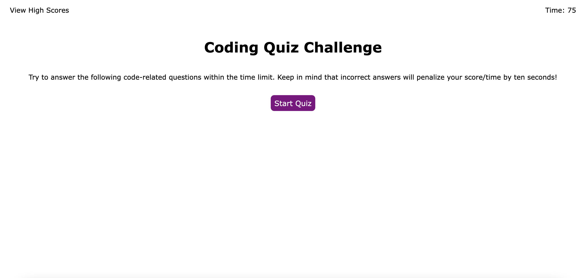
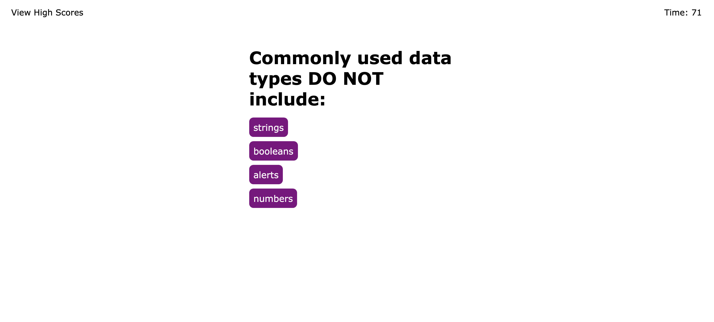
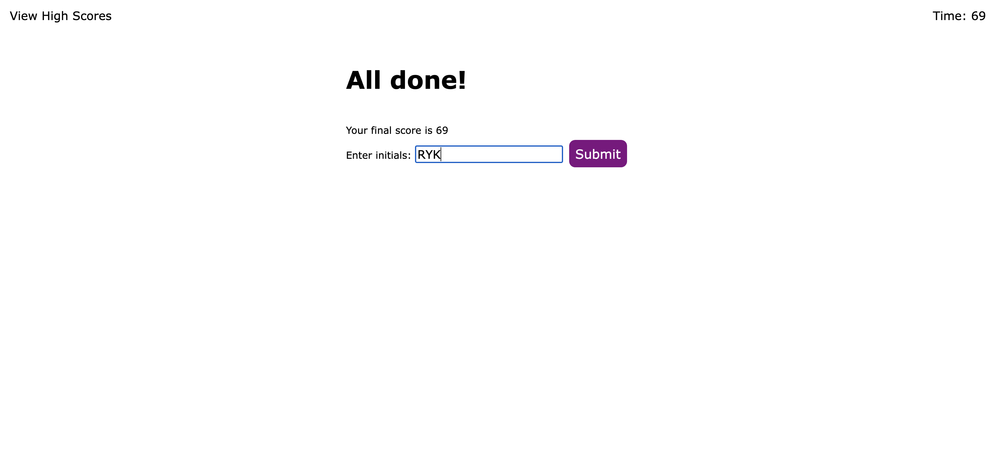
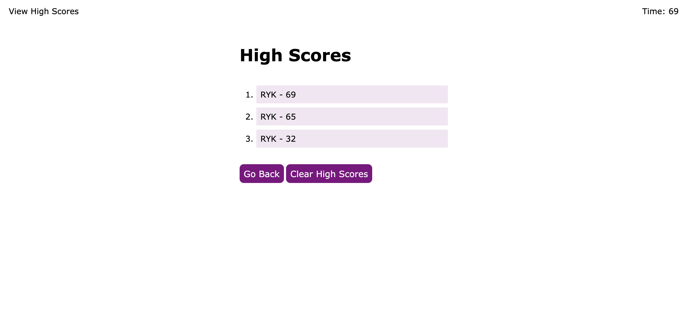

# code-quiz

## Description
This webpage was designed with the following user story in mind:
```
AS A coding boot camp student
I WANT to take a timed quiz on JavaScript fundamentals that stores high scores
SO THAT I can gauge my progress compared to my peers
```

In order to fulfill this user story, the final result was judged by these criteria:
```
GIVEN I am taking a code quiz
WHEN I click the start button
THEN a timer starts and I am presented with a question
WHEN I answer a question
THEN I am presented with another question
WHEN I answer a question incorrectly
THEN time is subtracted from the clock
WHEN all questions are answered or the timer reaches 0
THEN the game is over
WHEN the game is over
THEN I can save my initials and my score
```

## Installation
N/A

## Usage
This webpage can be accessed at: https://rykaplan1.github.io/code-quiz













## Credits
N/A

## License
N/A
